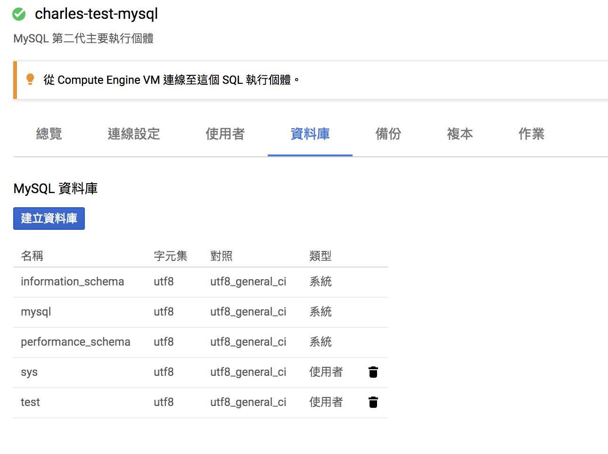

# Choice SQL page
Choice SQL page at google cloud console.

# Create Instance
Click 「建立執行個體」

# Choice DB type
We choice mysql

# Input DB information
Input instance name, root's password, region.

# View db infomation page
Monitor db metrics.

# Modify db connection setting
You can setting firewall here.

# DB user setting
If you want add db user, you can add user here.

# DB instance management
Add instance here.

# Reference
[https://cloud.google.com/sql/docs/mysql/connect-admin-ip?hl=zh-tw#install-mysql-client](https://cloud.google.com/sql/docs/mysql/connect-admin-ip?hl=zh-tw#install-mysql-client)
