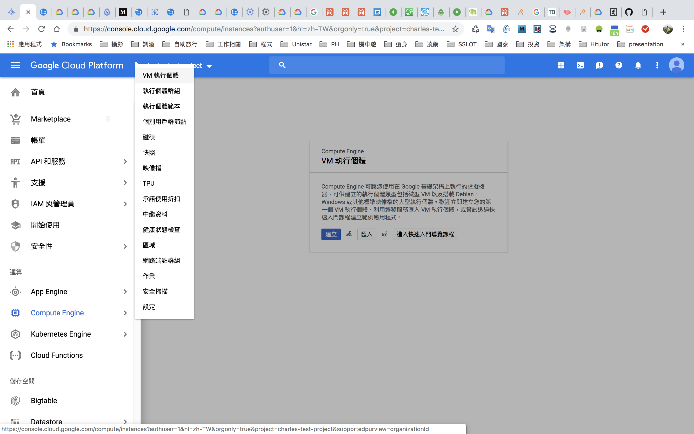
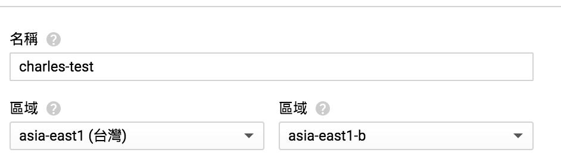
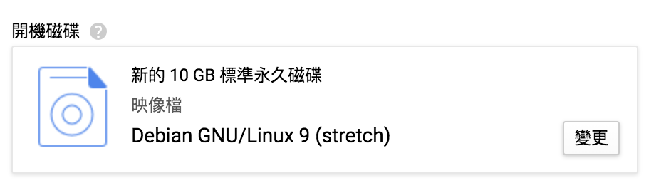
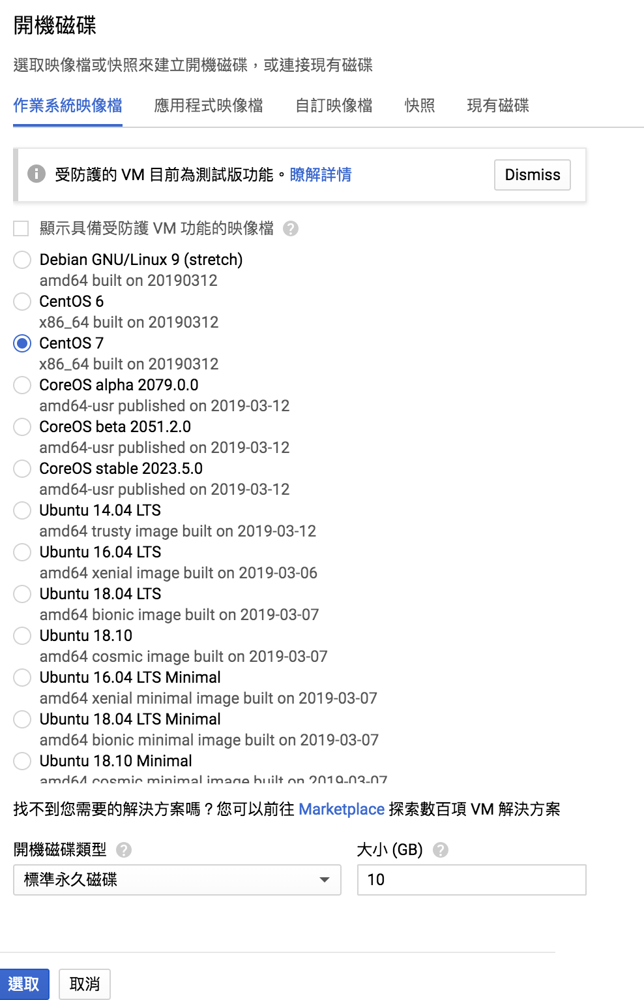
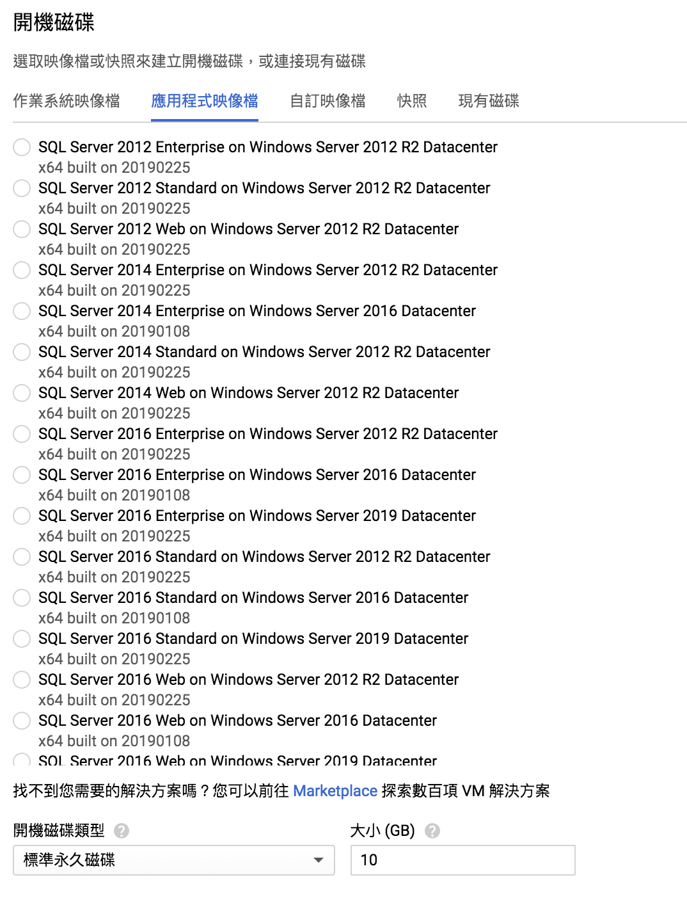
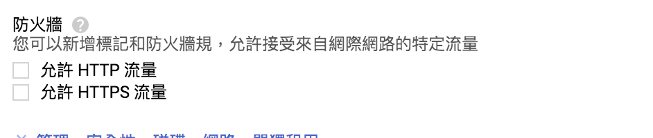
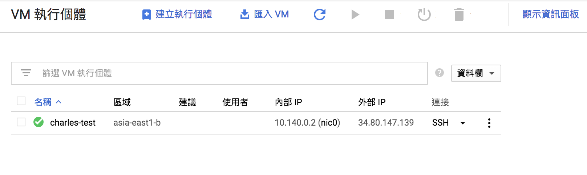

# choice gce vm

# input vm name, and choice reigon

# choice os dockerfile

# if you want add sql server, or other type vm, you can choice at「應用程式映象檔」
 

# open http or https port

# wait a moment, you will see vm startup
