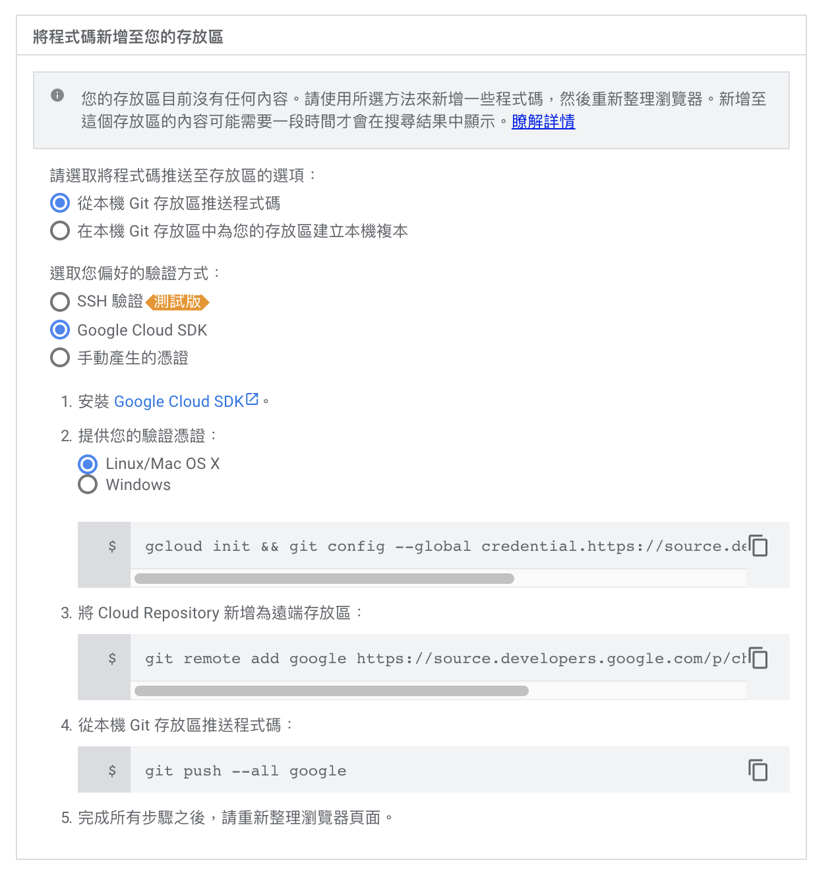

# use command line
* Run this command of create repository
```shell
sudo gcloud source repos create hello-world
```
* Check Repository created on remote 
[https://source.cloud.google.com/?authuser=1&hl=zh-TW](https://source.cloud.google.com/?authuser=1&hl=zh-TW)

# follow web view
* input url in chrome
[https://source.cloud.google.com/?authuser=1&hl=zh-TW](https://source.cloud.google.com/?authuser=1&hl=zh-TW)
* click 「新增存放區」

* click「建立新的存放區」

* input repository infomation

* follow guideline, and you will create repository

# Reference
* [https://adon988.logdown.com/posts/7811172-gcloud-sdk-installation-method](https://adon988.logdown.com/posts/7811172-gcloud-sdk-installation-method)
